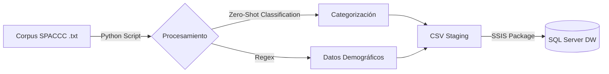

# Aplicación de Modelos de Lenguaje Grandes (LLMs) en el Procesamiento de Texto Clínico

**Línea 10: Almacenes de Datos**
**Universidad de Málaga | Grado en Ingeniería de la Salud – Bioinformática**

**Autores:**

* Hugo Salas
* Aissa Omar
* Youssef Barakat

**Fecha:** Diciembre 2025

---

## 📋 Descripción del Proyecto

Este proyecto explora la viabilidad de utilizar **Modelos de Lenguaje Grandes (LLMs)** como **capa de transformación** dentro de un proceso **ETL (Extract, Transform, Load)** aplicado al ámbito sanitario.

El objetivo principal es **estructurar información clínica no estructurada** (texto libre) procedente del **corpus SPACCC** (1000 historias clínicas), clasificándola automáticamente y cargándola en un **Almacén de Datos (Data Warehouse)** en **SQL Server** para su posterior análisis.

El sistema implementa una arquitectura híbrida que combina:

* **NLP con Deep Learning**: Clasificación *Zero-Shot* para categorizar patologías y procedimientos clínicos.
* **Reglas Heurísticas**: Uso de expresiones regulares para la extracción de datos demográficos.
* **Business Intelligence**: Integración mediante SSIS y modelado dimensional.

---

## 🚀 Arquitectura del Pipeline

El flujo de datos sigue una arquitectura **ETL clásica potenciada por IA**:



---

## 🧰 Tecnologías Utilizadas

* **Lenguaje**: Python 3.x
* **Modelo LLM**: `joeddav/xlm-roberta-large-xnli` (Hugging Face Transformers)
* **ETL**: SQL Server Integration Services (SSIS)
* **Base de Datos**: SQL Server (Esquema de Estrella)
* **Librerías**: `pipelines, transformers, torch, tqdm, pandas`

---

## 🧠 Metodología de Clasificación

A diferencia de los enfoques supervisados tradicionales, este proyecto utiliza una estrategia de **Zero-Shot Classification**, formulando la tarea como un problema de **Natural Language Inference (NLI)**.

Este enfoque permite clasificar textos clínicos en categorías predefinidas **sin necesidad de un conjunto de entrenamiento etiquetado**, lo cual resulta especialmente útil en dominios clínicos con escasez de datos anotados.

### Dimensiones Analizadas

| Dimensión    | Categorías (ejemplos)                                       |
| ------------ | ----------------------------------------------------------- |
| Especialidad | Urología, Cardiología, Oncología, Neurología, Neumología    |
| Diagnóstico  | Neoplasia maligna, Infección, Patología vascular, Quiste    |
| Tratamiento  | Cirugía (abierta/laparoscópica), Quimioterapia, Observación |

* **Batch size**: 16
* **Optimización**: Inferencia acelerada mediante GPU

---

## 🗄️ Modelo de Datos (Data Warehouse)

Los resultados se almacenan en un **esquema dimensional en estrella**, diseñado para facilitar el análisis clínico y epidemiológico.

### 📌 Tabla de Hechos

* **fact_historia_clinica**

  * Métricas: `confidence_score` (confianza del modelo), `edad`, `sexo`
  * Claves foráneas: Especialidad, Diagnóstico, Tratamiento

### 📐 Dimensiones

* `dim_especialidad`
* `dim_diagnostico`
* `dim_tratamiento`

---

## 📊 Resultados del Análisis (Corpus SPACCC)

Tras procesar las **1000 historias clínicas**, se obtuvo la siguiente distribución (*Top 5 por categoría*):

### Distribución por Especialidad

| Especialidad | Casos |
| ------------ | ----- |
| Neumología   | 299   |
| Urología     | 278   |
| Cardiología  | 100   |
| Digestivo    | 99    |
| Nefrología   | 78    |

### Distribución por Diagnóstico

| Diagnóstico            | Casos |
| ---------------------- | ----- |
| Quiste                 | 167   |
| Patología vascular     | 122   |
| Enfermedad autoinmune  | 121   |
| Obstrucción            | 116   |
| Enfermedad neurológica | 94    |

### Distribución por Tratamiento

| Tratamiento        | Casos |
| ------------------ | ----- |
| Tratamiento médico | 222   |
| Observación        | 212   |
| Combinado          | 187   |
| Endoscopia         | 169   |
| Quimioterapia      | 76    |

> **Nota:** El `confidence_score` promedio fue **0.174**, no se recomienda su uso fuera del ámbito académico.

---

## 🔧 Instalación y Ejecución

### Requisitos

* Python 3.8+ con soporte para PyTorch/CUDA
* SQL Server 2017+
* Visual Studio con Data Tools (SSIS)

### Configuración del Entorno Python

```bash
pip install -r requirements.txt
```

### Ejecución del Proceso ETL

```bash
python python/procesar_historias_clinicas.py
```

* Genera el archivo `staging_historias.csv`

### Carga en Base de Datos

1. Ejecutar el script:

```sql
sql/ddl_dwh.sql
```

2. Ejecutar el paquete SSIS:

```text
ssis/Package.dtsx
```

---

## 📄 Referencias y Bibliografía

* Vaswani et al. (2017). *Attention Is All You Need*.
* Devlin et al. (2019). *BERT: Pre-training of Deep Bidirectional Transformers*.
* PlanTL (2023). *Recursos lingüísticos para el español – Corpus SPACCC*.
* Carrino et al. (2021). *Biomedical and Clinical Language Models for Spanish*.

---

Proyecto realizado para la asignatura **Almacenes de Datos**,
**Universidad de Málaga – 2025**.
